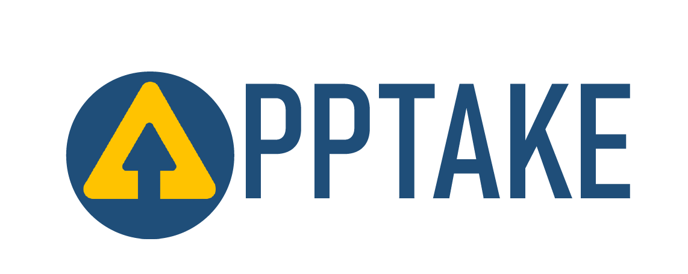
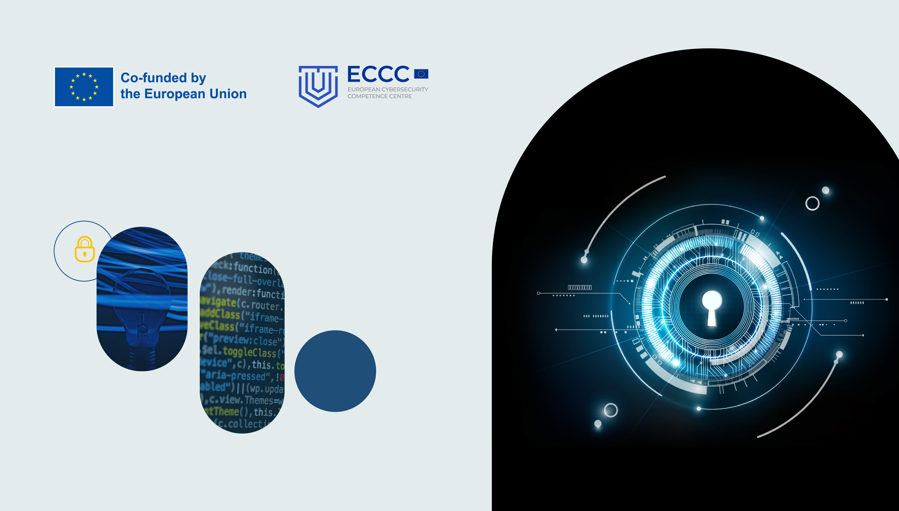

# APPTake Project

## Project Information

With  **APPtake**  – Uptake of Innovative Application Cybersecurity Solutions  **we aim to build** **a portfolio of sustainable application cybersecurity solutions**  to foster the adoption of DevSecOps practices by the European SMEs,  **increasing their cybersecurity capabilities.**
  
The project will make available a  **marketplace platform to support interaction between suppliers and adopters of cybersecurity solutions**  and where the solutions of the seven technology providers in the project will be made available.

**The project will include both supply and demand support measures**, implementing:  
• a maturity and integration phase of the solutions (supply)  
• featuring a massive demonstration plan with 6 end-users each from a different sector  
• a hybrid online plus in-presence strategy to reach commercial partners and customers (demand)

## CI/CD Services 

-   [Jenkins](https://jenkins.apptake.rid-intrasoft.eu/)  : CI/CD Automation Server
-   [Harbor](https://harbor.apptake.rid-intrasoft.eu/)  : Container Image Registry
-   [SonarQube](https://sonarqube.apptake.rid-intrasoft.eu/)  : Static Code Analysis

## Website and Social Media

-   [APPTake Website](https://www.apptake.eu/)
-   [LinkedIn](https://www.linkedin.com/company/apptake/)
-   [GitHub](https://github.com/APPTake-eu)

